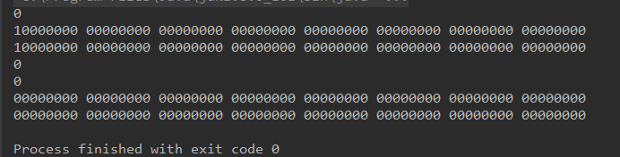

#实习报告\#3

##实习题目
用位示图管理磁盘存储空间

##设计思路
###对象设计
- BitMap 位示图
- Byte 位示图中的一个字节
- Bit 字节中的一位
- Work 作业

###方法解释
- insertWork 插入作业
>遍历位示图中的字节，遍历字节中的位，找到state=0，即该位为空的位，将该位state置1.输出经过转化的物理地址
- deleteWork 删除作业
>遍历字节中的位，找到该work所在的位，置state为0，输出在位示图中的 索引即位置

##实验结果

