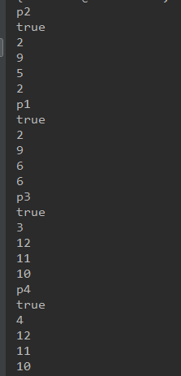

#实习报告\#4

##实习题目
银行家算法的实现

#实习内容
设计程序实现银行家算法

#设计思路
##对象设计
work类（表示占用资源的作业）
- HashMap resourceNeedMap 表示当前需要的资源
- HashMap resourceUsedMap 表示当前已经使用的资源
- HashMap resourceMaxMap 表示总共需要的资源
- boolean finish 表示是否完成

Resource类（表示供分配的资源）
- int total 总量
- int available 可使用量
- int used 已分配量

##过程设计
- 初始化
创建若干种资源和作业，并设置相关参数
- 遍历作业列表，检查是否已经完成，如果没完成，检查当前作业的资源需求能否满足
- 若可以满足，则分配给这个进程，完成这个作业并回收资源
- 重复2、3步

#实验结果

